# A-Chong-co Chocolate Factory Website

Simple Stock Management Website made using pure PHP, HTML, CSS, and JS. Here are the key features:

- Login and Register account,
- User can buy items,
- Superuser/Admin can create new item and restock item,
- Some functions updated using AJAX,
- Data are saved on MySQL databases,
- no framework library used, but I made my own, worked around MVC concept

## Requirements

1. PHP
1. Mysql
1. Your favorite browser

## Setting Up

1. Install Requirements (I used [XAMPP](https://www.apachefriends.org/download.html))
1. Clean (delete all files) inside PHP htdocs folder
1. Clone repo inside PHP htdocs folder
1. Restore `chocofac20201009.sql`
1. Copy `config.example.ini` ke `config.ini`, adjust

## Restoring Database

1. Open mysql on repo's root folder

```
mysql -u root -p
```

2. Create new database

```
CREATE DATABASE chocofac;
```

3. Execute queries

```
source chocofac20201009.sql
```

This will create:

- 200 users + 1 superuser
- 100 chocolates
- 2211 transactions

## Running

1. Run PHP and MySQL (again, I used XAMPP)
1. Open localhost:\$PORT (default is [localhost:80](localhost:80))

## Project Structure

```
htdocs
├───application
│   ├───config
│   ├───controllers
│   ├───models
│   └───views
├───framework
│   ├───core
│   └───database
├───mockup
├───public
│   ├───css
│   ├───html
│   │   ├───chocolate
│   │   ├───error
│   │   └───user
│   ├───images
│   ├───js
│   ├───templates
│   └───uploads
└───wwwroot
```

- application: contains MVC(models, views, controllers) and config folder
- framework: custom framework, based on MVC
- public/html: divided as per model
- public/images: sample images
- public/uploads: uploaded images goes here
- wwwroot: first redirect, sanitize url, runs framework

## Main Features

### Register

> To register a new account

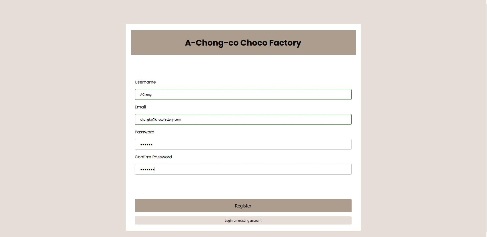
Valid example
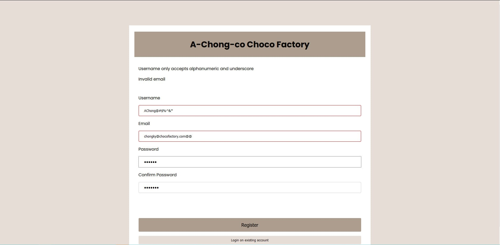
Invalid example
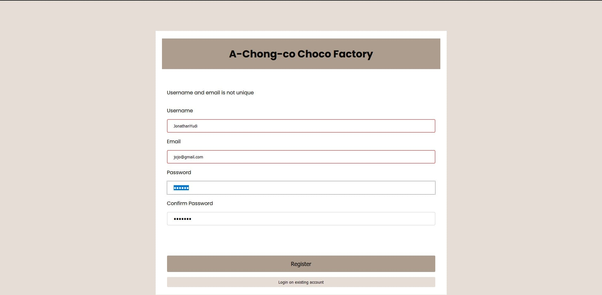
Not unique example (username-email pair already taken)

### Login

> Must login before entering website

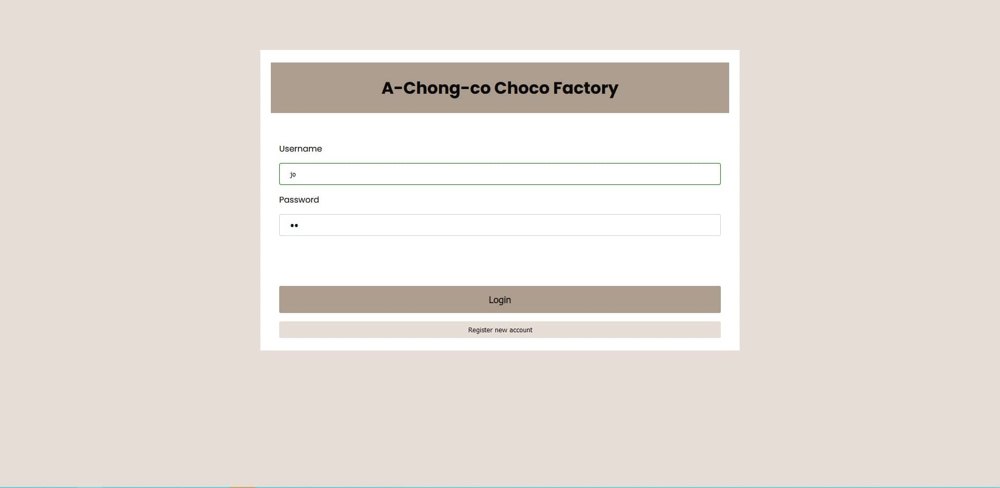

### Search by name

> using search bar on top

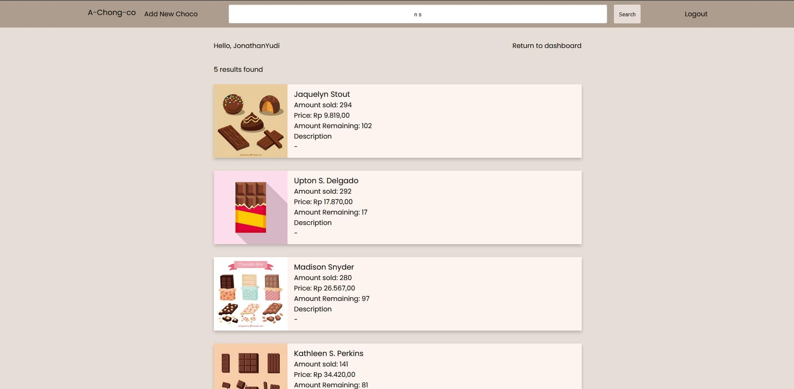
with pagination:
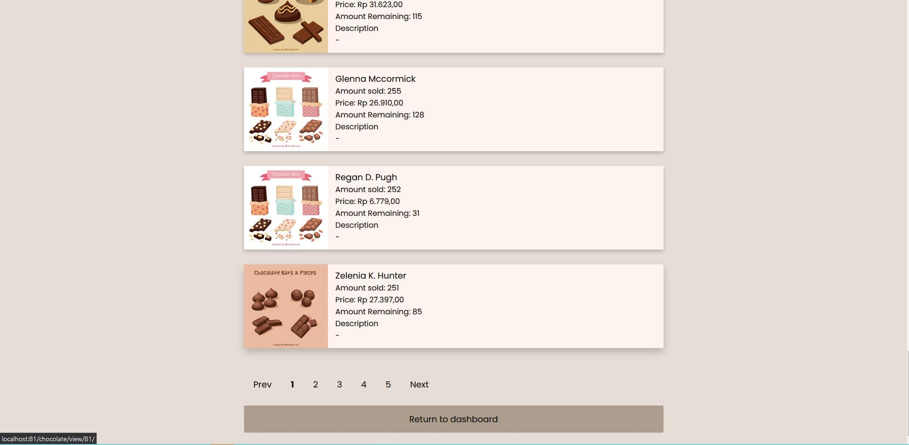
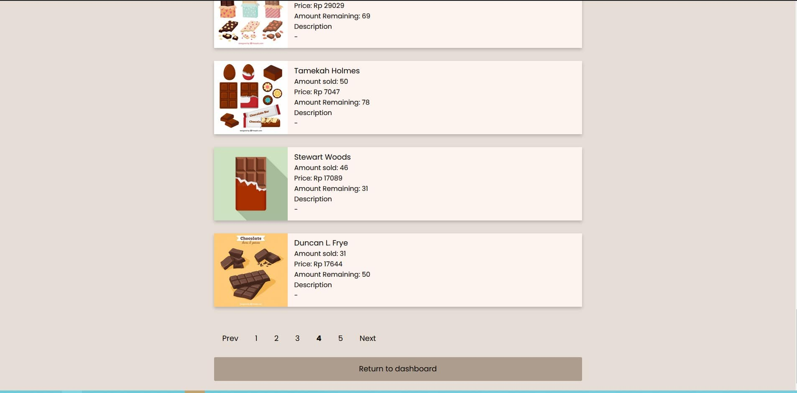

### Chocolate Detail

> Click on a chocolate card to see detail

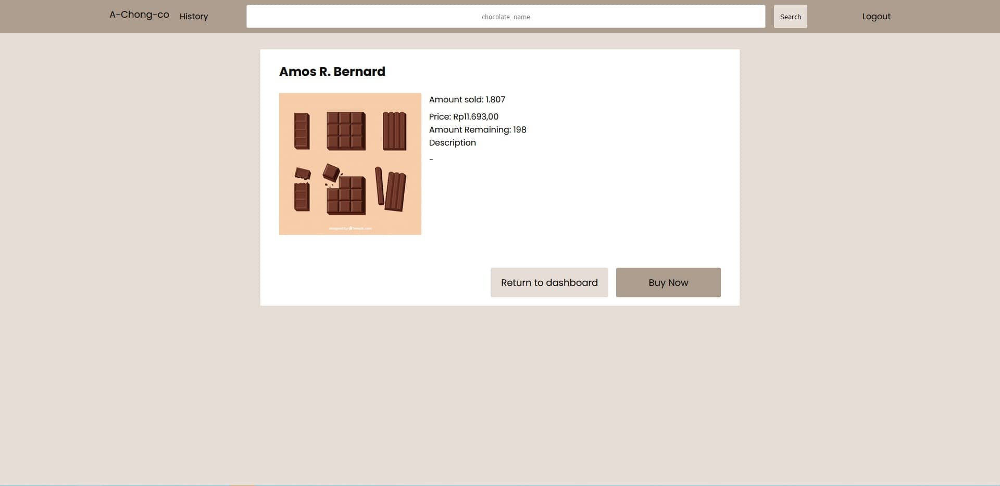
viewed as normal user
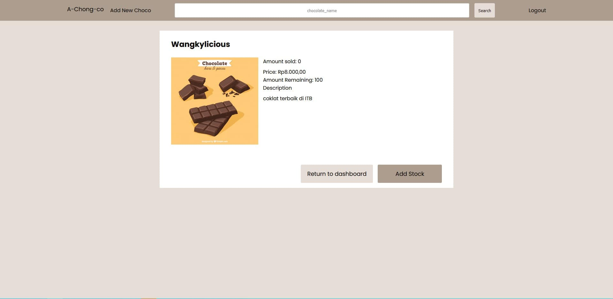
viewed as super user

### Buy Chocolate

> Click `Buy Now` on Chocolate Detail page (as normal user)

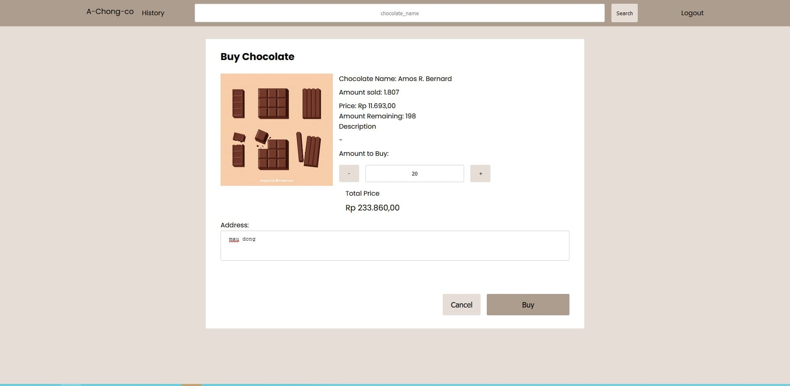

> Click `Buy` to buy, or `Cancel` to cancel

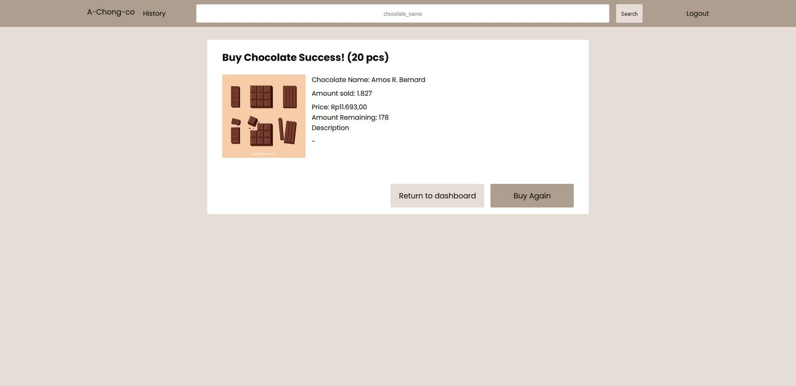

### Add Chocolate Stock

> Click `Add Stock` on Chocolate Detail page (as superuser)

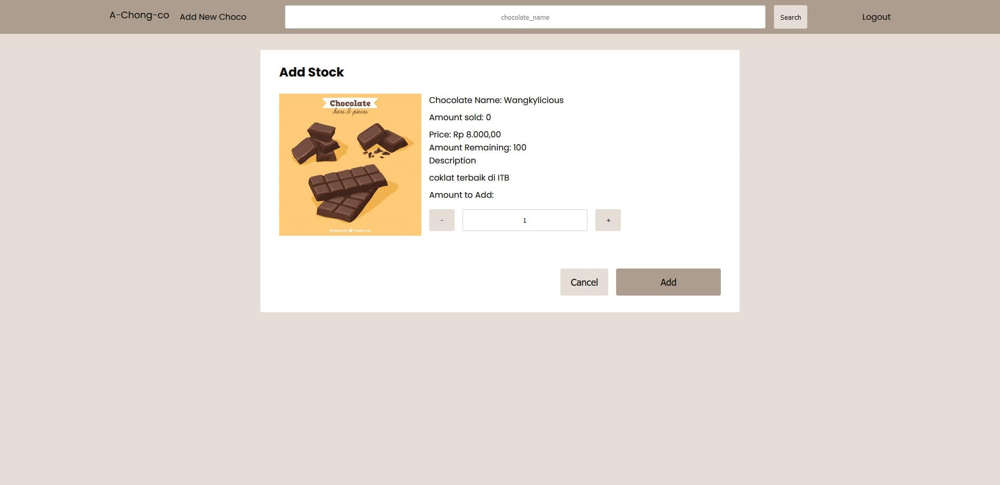

> Click `Add` to add stock, or `Cancel` to cancel

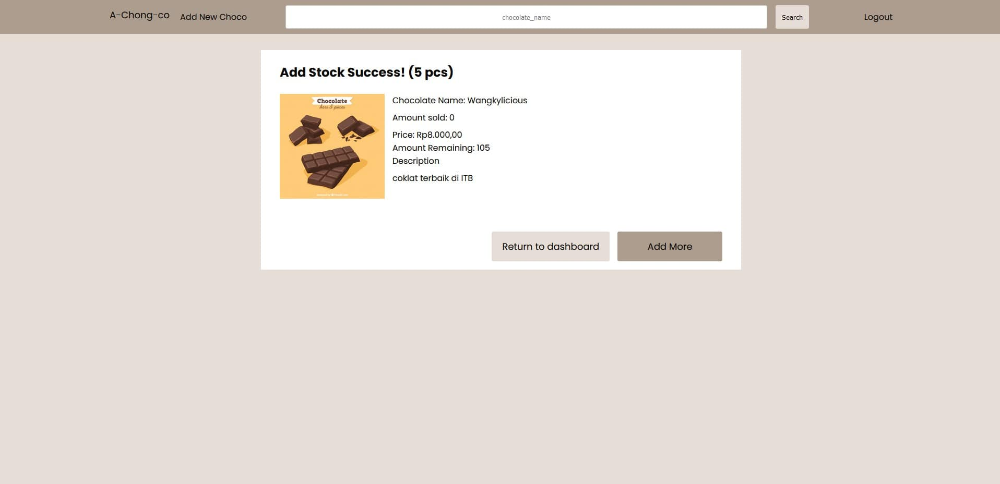

### Transaction History

> Click `History` on navigation bar (on top of the page) (as user)

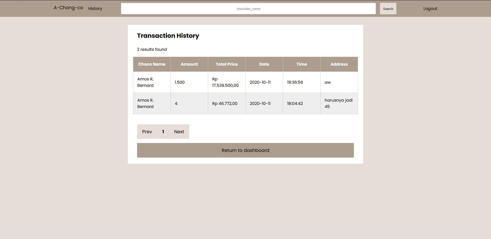
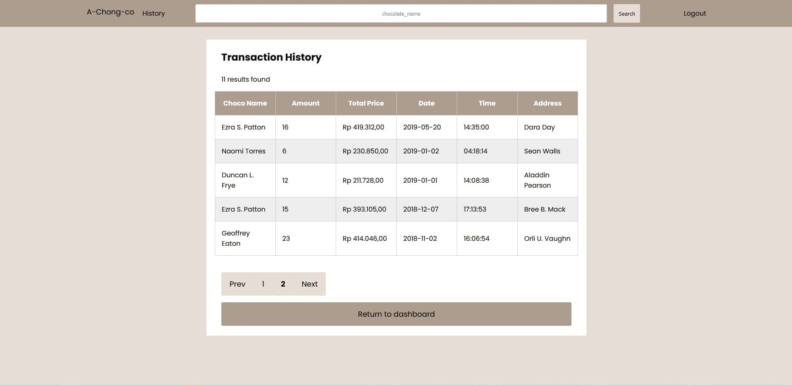
with pagination

### Add New Chocolate

> Click `Add New Choco` on navigation bar (on top of the page) (as superuser)


> Click `Add` to add new chocolate, or `Cancel` to cancel

will redirect to that chocolate details page after succesful adding new choco

## Bonus Features

### Cookie Access Token

> Cookie is not plain username-password pair anymore

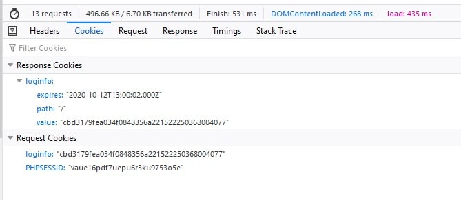
using SHA-1 of salted username+password+secret

### Real Time Stock

> will check again on database, not only on frontend

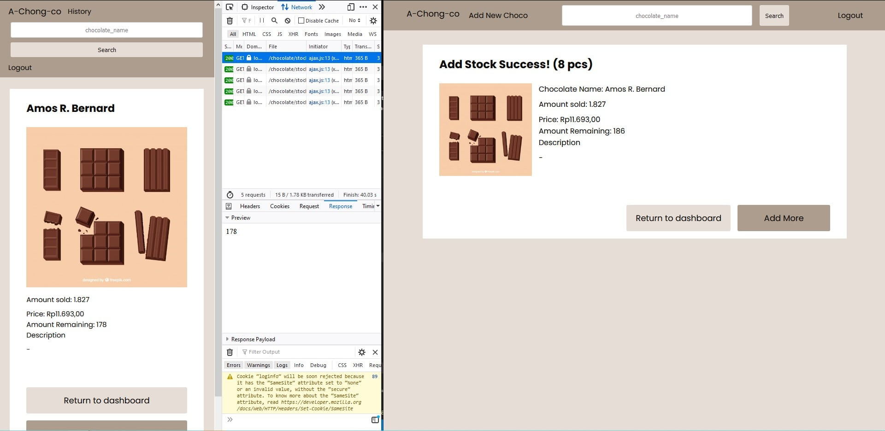
before
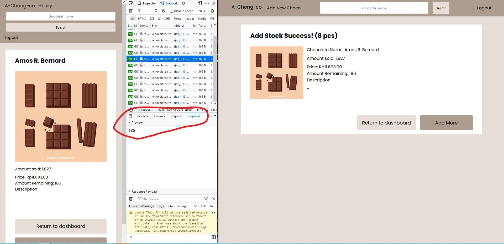
after

### Responsive Layout

> utilising CSS Grid, mimicking Bootstrap Grid Layout (`row` class)

already shown above

### Successful Add/Buy Feedback

> So the user know if it is successful


## Pembagian Tugas

### Front End

1. Login: 13518084
1. Register: 13518084
1. Dashboard: 13518084
1. Search Result: 13518084
1. Chocolate Detail: 13518084
1. Buy Chocolate: 13518084
1. Add Stock Chocolate: 13518084
1. Transaction History: 13518084
1. Add New Chocolate: 13518084
1. Bonus: 13518084

### Back End

1. Login: 13518084
1. Register: 13518084
1. Dashboard: 13518084
1. Search Result: 13518084
1. Chocolate Detail: 13518084
1. Buy Chocolate: 13518084
1. Add Stock Chocolate: 13518084
1. Transaction History: 13518084
1. Add New Chocolate: 13518084
1. Bonus: 13518084

### References

Basic PHP Knowledge

- XAMPP: https://www.javatpoint.com/xampp
- MySQL: https://www.tutorialspoint.com/mysql/index.htm

Creating Custom Framework

- MVC: https://www.codeproject.com/Articles/1080626/Code-Your-Own-PHP-MVC-Framework-in-Hour
- Templating: https://softwareengineering.stackexchange.com/questions/159529/how-to-structure-template-system-using-plain-php

Other PHP Knowledge

- Pagination: https://www.malasngoding.com/membuat-paging-dengan-php-dan-mysql/
- AJAX: https://www.w3schools.com/php/php_ajax_php.asp

Frontend Design

- Responsive Table: https://codepen.io/andornagy/pen/EVXpbR
- CSS Grid: https://speckyboy.com/replicate-bootstrap-grid-using-css-grid/

## Author

Jonathan Yudi Gunawan - 13518084

## Ideas

- superuser notified when stock empty
