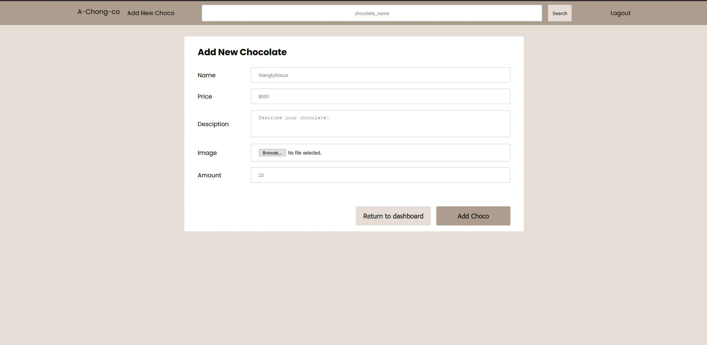

# A-Chong-co Chocolate Factory Website

Simple Stock Management Website made using pure PHP, HTML, CSS, and JS. Here are the key features:

- Login and Register account,
- User can buy chocolate,
- Superuser/Admin can create new chocolate and restock chocolate,
- Some functions updated using AJAX,
- Data are saved on MySQL databases,
- no framework library used, but I made my own, worked around MVC concept

Update Oct 19, 2020:

- deployed on [http://jonathan.elseproperty.com/](http://jonathan.elseproperty.com/)

Update Nov 17, 2020:

- Integrated with factory website.
- Add stock only sends deliver request to factory (wait factory approval).
- Add new chocolate need to submit recipe (ingredient list).

Use branch `webonly` to use older version.

## Requirements

1. PHP (tested on 5.6+)
1. Mysql (tested on 5.5.8)
1. Python 3 (tested on 3.6+) - for populating sample image
1. Your favorite browser

## Setting Up

1. Install Requirements (I used [XAMPP](https://www.apachefriends.org/download.html) to install all requirements)
1. Clean (delete all files) inside PHP root document folder (i.e: `htdocs` on XAMPP)
1. Clone repo inside PHP root document folder (i.e: `htdocs` on XAMPP)
1. Open folder `application/config`
1. Duplicate `config.example.ini`, rename to `config.ini`
1. Adjust `config.ini` if needed
1. Run PHP and MySQL (more info see next section)
1. Restore database schema (more info see next section)
1. Restore chocolate images (more info see next section)

## Running

1. Run PHP and MySQL (again, I used [XAMPP](https://www.apachefriends.org/download.html))
   - If using XAMPP: press `Start` on Apache(PHP) and MySQL
2. Open localhost:\$PORT on browser (default url is [http://localhost:80/](http://localhost:80/))

## Restoring Database

1. Open mysql on repo's root folder

```
mysql -u root -p
```

2. Enter mysql password (default is empty)

3. Create new database

```
CREATE DATABASE chocofac;
```

4. Use database

```
USE chocofac;
```

4. Execute queries

```
source chocofac20201009.sql
```

This will create:

- 200 users + 1 superuser
- 100 chocolates
- 2211 transactions

## Restoring Chocolate Images

sample images is not all saved on repo, you can populate them by running this script:

```
python populate_uploads.py
```

## Project Structure

```
htdocs
├───application
│   ├───config
│   ├───controllers
│   ├───models
│   └───views
├───framework
│   ├───core
│   └───database
├───mockup
├───public
│   ├───css
│   ├───html
│   │   ├───chocolate
│   │   ├───error
│   │   ├───home
│   │   ├───templates
│   │   └───user
│   ├───images
│   ├───js
│   └───uploads
├───screenshot
└───wwwroot
```

- application: contains MVC(models, views, controllers) and config folder
- framework: custom framework, based on MVC
- public/html: divided as per model
- public/images: sample images
- public/uploads: uploaded images goes here
- wwwroot: first redirect, sanitize url, runs framework

## Main Features

### Register

> To register a new account


Valid example


Invalid example


Not unique example (username-email pair already taken)

### Login

> Must login before entering website


### Dashboard

> Showing top 10 chocolates by amount sold


as viewed by normal user (difference on navbar)


as viewed by super user (difference on navbar)

### Search by name

> using search bar on top


with pagination:


### Chocolate Detail

> Click on a chocolate card to see detail


viewed as normal user (user can buy)


viewed as super user (user can add stock)

### Buy Chocolate

> Click `Buy Now` on Chocolate Detail page (as normal user)


> Click `Buy` to buy, or `Cancel` to cancel


prompt after succesful transaction

### Add Chocolate Stock

> Click `Add Stock` on Chocolate Detail page (as superuser)


> Click `Add` to add stock, or `Cancel` to cancel


prompt after succesful add stock

### Transaction History

> Click `History` on navigation bar (on top of the page) (as user)


with pagination

### Add New Chocolate

> Click `Add New Choco` on navigation bar (on top of the page) (as superuser)



> Click `Add` to add new chocolate, or `Cancel` to cancel


will redirect to that chocolate details page after succesful adding new choco

## Bonus Features

### Cookie Access Token

> Cookie is not plain username-password pair anymore


using SHA-1 of salted username+password+secret

### Real Time Stock

> will check again on database, not only on frontend


before


after

### Responsive Layout

> utilising CSS Grid, mimicking Bootstrap Grid Layout (`row` class)

already shown above

### Successful Add/Buy Feedback

> So the user know if it is successful


## Pembagian Tugas

### Front End

1. Login: 13518084
1. Register: 13518084
1. Dashboard: 13518084
1. Search Result: 13518084
1. Chocolate Detail: 13518084
1. Buy Chocolate: 13518084
1. Add Stock Chocolate: 13518084
1. Transaction History: 13518084
1. Add New Chocolate: 13518084
1. Bonus: 13518084

### Back End

1. Login: 13518084
1. Register: 13518084
1. Dashboard: 13518084
1. Search Result: 13518084
1. Chocolate Detail: 13518084
1. Buy Chocolate: 13518084
1. Add Stock Chocolate: 13518084
1. Transaction History: 13518084
1. Add New Chocolate: 13518084
1. Bonus: 13518084

### References

Basic PHP Knowledge

- XAMPP: https://www.javatpoint.com/xampp
- MySQL: https://www.tutorialspoint.com/mysql/index.htm

Creating Custom Framework

- MVC: https://www.codeproject.com/Articles/1080626/Code-Your-Own-PHP-MVC-Framework-in-Hour
- Templating: https://softwareengineering.stackexchange.com/questions/159529/how-to-structure-template-system-using-plain-php

Other PHP Knowledge

- Pagination: https://www.malasngoding.com/membuat-paging-dengan-php-dan-mysql/
- AJAX: https://www.w3schools.com/php/php_ajax_php.asp

Frontend Design

- Responsive Table: https://codepen.io/andornagy/pen/EVXpbR
- CSS Grid: https://speckyboy.com/replicate-bootstrap-grid-using-css-grid/

## Author

Jonathan Yudi Gunawan - 13518084

## Ideas

- superuser notified when stock empty
